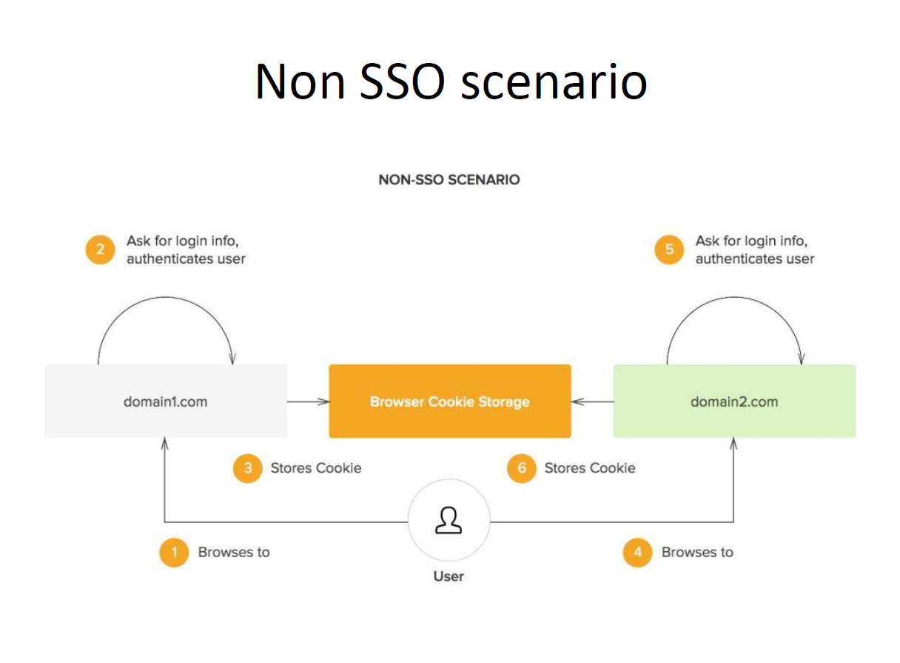

# Cyber-Security-Fundamentals
I have completed Cyber Security fundamental bootcamp in 2023, just revising the course, documenting and saving the useful resources.
## EYGDS Cybersecurity Bootcamp Certificate 

# 👨‍💻 SSO: Single Sign On
## ✅ Single Sign On (SSO) is a type of authentication in which a user logs in to one system and is automatically granted access to other services.
### NON-SSO Architecture

### SSO Architecture

